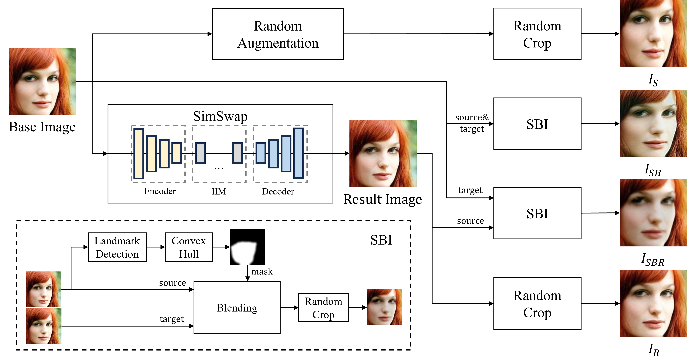

# SimSwap-evolved-SelfBlendedImages

## Overview
This project utilizes **SelfBlendedImages** and **SimSwap** to generate a dataset for Deepfake detection. Since this project has made modifications to both repositories, users need to download them separately and apply the provided modifications.

## Installation and Setup

### 1. Download Dependencies
Please manually download the following repositories and rename them:

#### **SelfBlendedImages**
Download from [SelfBlendedImages Repository](https://github.com/mapooon/SelfBlendedImages):
```bash
git clone https://github.com/mapooon/SelfBlendedImages.git
```
The downloaded folder may be named **SelfBlendedImages-master**. Please rename it to **SelfBlendedImages**:
```bash
mv SelfBlendedImages-master SelfBlendedImages
```

#### **SimSwap**
Download from [SimSwap Repository](https://github.com/neuralchen/SimSwap):
```bash
git clone https://github.com/neuralchen/SimSwap.git
```
The downloaded folder may be named **SimSwap-main**. Please rename it to **SimSwap**:
```bash
mv SimSwap-main SimSwap
```

### 2. Apply Modifications
Copy the contents of `modified/` into the corresponding directories to apply the necessary changes.

#### **Apply Modifications to SelfBlendedImages**
```bash
cp -r modified/SelfBlendedImages-modified/* SelfBlendedImages/
```

#### **Apply Modifications to SimSwap**
```bash
cp -r modified/SimSwap-modified/* SimSwap/
```

Alternatively, manually copy the files from `SelfBlendedImages-modified` into `SelfBlendedImages`, and from `SimSwap-modified` into `SimSwap`, replacing the existing files when prompted.

### 3. Run the Project
Once everything is set up, you can run the project using:
```bash
python Generate_SSSBI.py
```

## Workflow Diagram
Below is a workflow diagram illustrating the setup process:



## Project Directory Structure
After completing the setup, your project structure should look like this:
```plaintext
MyProject/
│── README.md
│── Generate_SSSBI.py
│── SelfBlendedImages/        # Downloaded and renamed
│── SimSwap/                  # Downloaded and renamed
│── modified/                 # Provided modifications
│   ├── SelfBlendedImages-modified/
│   ├── SimSwap-modified/
│── pipeline.png              # Workflow diagram
```

## Notes
- Do **not** directly rename `SelfBlendedImages-modified` or `SimSwap-modified` to replace the original repositories.
- Ensure you **overwrite** the original files with the modifications instead.
- If you encounter any issues, check the repository links and ensure the correct file structure.

## License
This project follows the licenses of SelfBlendedImages and SimSwap. Please refer to their repositories for licensing details.

